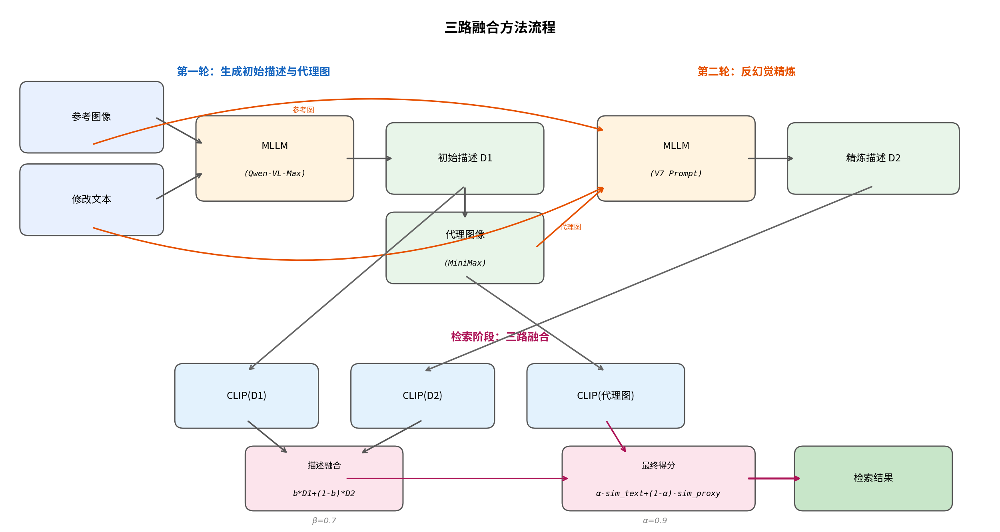

# 基于视觉代理与描述融合的零样本组合式图像检索改进

> 最终版说明：FashionIQ / CIRCO / CIRR 采用默认三路融合配置（β=0.7, α=0.9）；GeneCIS 采用专用 prompt + best α/β，当前统一结论为 **9/9 主指标上升、35/35 指标全部上升**。

## 一、研究背景

本课题复现并改进 CVPR 2025 Highlight 论文 OSrCIR（arXiv 2412.11077），研究零样本组合式图像检索（Zero-Shot Composed Image Retrieval, ZS-CIR）。该任务给定一张参考图像和一段修改文本，在图库中检索符合描述变化的目标图像，且无需针对特定数据集训练。

原论文的核心思路是：利用多模态大语言模型（MLLM）将参考图与修改文本转化为目标描述文本，再用 CLIP 编码该文本进行检索。本工作在此基础上提出三路融合方法，通过引入视觉代理图像和描述精炼机制进一步提升检索精度。

## 二、Baseline 复现

首先完整复现原论文方法，覆盖 FashionIQ（3 子集）、CIRCO、CIRR、GeneCIS（4 子集）共 9 个标准基准。

原论文使用 GPT-4o 作为 MLLM，本工作因 API 可用性限制，替换为阿里云千问 Qwen-VL-Max；视觉编码器保持一致，均为 CLIP ViT-L/14。MLLM 的替换导致描述生成质量存在差异，部分数据集的 Baseline 指标低于原论文报告值。此问题经与学长讨论确认，属于 MLLM 能力差异的正常影响，不影响改进方法本身的有效性验证（改进前后均使用同一 MLLM）。

下表列出原论文指标与本工作 Baseline 的对比。其中 FashionIQ 和 GeneCIS 的数据划分与原论文一致，可直接对比；CIRR 和 CIRCO 原论文报告的是 test split，本工作使用 val split，数值不直接可比，仅作参考。

| 数据集 | 指标 | 原论文 (GPT-4o) | 本工作 Baseline (Qwen-VL) | 差距 | 备注 |
|--------|:---:|:---:|:---:|:---:|------|
| FIQ dress | R@10 | 29.70 | 15.80 | −13.90 | 直接可比 |
| FIQ shirt | R@10 | 33.17 | 26.00 | −7.17 | 直接可比 |
| FIQ toptee | R@10 | 36.92 | 23.09 | −13.83 | 直接可比 |
| CIRR | R@1 | 29.45 | 22.96 | — | 不同 split |
| CIRCO | mAP@10 | 25.33 | 16.21 | — | 不同 split |
| GeneCIS ch_obj | R@1 | 18.40 | 13.88 | −4.52 | 直接可比 |
| GeneCIS fo_obj | R@1 | 15.00 | 16.02 | +1.02 | 直接可比 |
| GeneCIS ch_attr | R@1 | 17.20 | 12.70 | −4.50 | 直接可比 |
| GeneCIS fo_attr | R@1 | 20.90 | 18.82 | −2.08 | 直接可比 |

FashionIQ 受 MLLM 差异影响最大（dress R@10 下降近 14 个百分点），GeneCIS focus_object 则在 Qwen-VL 下反而略高于原论文。所有改进实验均以本工作的 Baseline 为基准进行对比，确保对比公平。

## 三、改进思路与迭代过程

### 3.1 核心难点

原论文方法的瓶颈在于：MLLM 仅凭参考图和修改文本进行一次推理，生成的目标描述 D1 缺乏视觉验证环节，无法判断描述是否准确反映了修改意图。一旦 D1 出现偏差（如遗漏关键变化、误解修改方向），后续 CLIP 编码和检索就会偏离目标。

围绕这一瓶颈，改进工作面临三个具体难点：

- **如何为纯文本描述引入视觉校验信号？** 原方法全程在文本空间操作，缺少图像级别的反馈。
- **如何在精炼描述时避免引入新的错误？** MLLM 在多轮交互中容易产生幻觉。
- **如何保证改进的通用性？** 9 个数据集涵盖时尚、自然场景、开放域等不同任务类型，单一策略难以通用。

### 3.2 方案一：视觉代理图（Visual Proxy）

为了引入视觉校验信号，首先尝试将 MLLM 生成的初始描述 D1 通过文生图模型（MiniMax image-01）"画"出来，生成一张代理图像（proxy image）。这张图的作用有两个：一是在检索阶段提供图像空间的互补信号，二是为第二轮精炼提供视觉参照。

在 FashionIQ dress 子集上进行了 50 样本的初步验证，测试了两种代理图使用方式：

- **后融合（Plan A）**：在检索阶段将代理图的 CLIP 特征与文本特征加权融合
- **前融合（Plan B）**：在精炼阶段将代理图送入 MLLM，辅助生成更准确的 D2

| 方法 | dress R@10 (50样本) |
|------|:---:|
| Baseline（纯 D1）| 18.0 |
| Plan A（后融合，α=0.8）| 26.0 |
| Plan B（前融合）| 22.0 |

两种方案均有明显提升，表明代理图确实能提供有价值的信息。最终方案将两者结合——前融合用于精炼 D2，后融合用于检索评分。

### 3.3 方案二：描述精炼（Refinement）与 prompt 迭代

代理图虽然提供了视觉参照，但如何设计精炼 prompt 让 MLLM 正确利用它，成了最核心的问题。

**第一次尝试（original prompt）：直接对比原图和代理图。** 在 prompt 中要求 MLLM 对比参考图和代理图的差异，据此修正描述。结果 CIRR R@10 从 67.0 降到 64.5（−2.5）。逐样本分析发现，MLLM 将代理图中 AI 生成的背景、材质等虚构细节写入了精炼描述，导致描述膨胀约 1.9 倍，在 CLIP 空间中反而远离目标。**这揭示了核心矛盾：代理图既是有用的参照，又是幻觉的来源。**

**第二次尝试（v5 prompt）：加入 CoT 推理链。** 在 prompt 中增加了分步推理结构（先分析原图 → 再分析代理图 → 再输出描述），试图通过结构化思考减少幻觉。CIRR R@10 略有改善（65.5，−1.5），但幻觉问题没有根本解决，MLLM 在推理过程中仍然会引用代理图的细节。

**第三次尝试（v6 prompt）：将第一轮完整输出传给 MLLM。** 把 D1 和代理图一起作为上下文送入 MLLM，希望 MLLM 能在此基础上修正。结果灾难性崩溃，CIRR R@10 跌至 49.5（−17.5）。原因是信息过载导致 MLLM 对原始描述进行了过度修改，丢失了 D1 中本来正确的内容。

**关键突破（v7 prompt）：代理图仅做诊断工具 + 强制短描述。** 经过前三轮失败，得到一个关键认识：必须在 prompt 层面切断 MLLM 从代理图中提取细节的路径。V7 prompt 做了三个核心设计：

1. 明确声明"代理图是 AI 生成的，包含幻觉细节，禁止描述代理图中的内容"
2. 代理图的唯一用途是检查修改是否正确（如颜色是否对、物体是否变化）
3. 输出描述必须简短，长度不超过修改文本

V7 在 CIRR 上取得了 R@10=73.5（+6.5）的大幅提升，验证了"诊断而非描述"这一设计思路的有效性。但在 FashionIQ shirt 子集上出现了 R@10 从 30.0 降到 26.0（−4.0）的退化。分析发现，V7 的强制短描述策略导致 shirt 子集中部分关键词被截断。

**后续尝试（v9、v10 prompt）：试图兼顾两端。** v9 尝试在 V7 基础上保留区分性关键词，CIRR 提升消失（R@10=67.5）；v10 折中 v7 和 v9 的策略，两个数据集都不理想（R@10=66.0）。**这说明单一 prompt 策略存在固有矛盾：激进精炼有助于修正偏差但可能丢失信息，保守精炼保留信息但改善有限。**

### 3.4 方案三：描述融合（Description Ensemble）

上述矛盾的根本原因是：直接用 D2 替换 D1 是一个"全有或全无"的决策，无法处理 D2 部分好部分差的情况。

解决思路是在 CLIP 特征空间中对 D1 和 D2 进行加权平均，而非替换。这样即使 D2 在某些样本上质量较差，D1 的信号仍然占主导地位，整体不会退化。

将 V7 prompt 与 Description Ensemble 组合后，实现了所有子集的统一正向提升：

| 方法 | CIRR R@10 | shirt R@10 |
|------|:---:|:---:|
| Baseline（纯 D1）| 67.0 | 30.0 |
| V7 单独（用 D2 替换 D1）| 73.5 (+6.5) | 26.0 (−4.0) |
| V7 + Ensemble（β=0.7）| 69.0 (+2.0) | 30.5 (+0.5) |

Ensemble 虽然牺牲了 V7 在 CIRR 上的极端提升（从 +6.5 降为 +2.0），但换来了全部子集的正向提升。β=0.7 表示 D1 特征占 70%、D2 特征占 30%，既保留了精炼带来的改善，又用 D1 的信号"兜底"。

### 3.5 最终方法：三路融合

将以上三个方案组合为完整的三路融合流程，如下图所示。

**第一轮**：参考图 + 修改文本 → MLLM → 初始描述 D1 → 文生图模型 → 代理图

**第二轮**：参考图 + 代理图 + 修改文本 → MLLM（V7 反幻觉 prompt）→ 精炼描述 D2

**检索**：融合三路信号——D1 特征、D2 特征、代理图特征

检索公式如下。首先对两轮描述的 CLIP 特征进行加权融合：

    f_text = normalize( β × CLIP(D1) + (1−β) × CLIP(D2) )

然后将文本相似度与代理图相似度混合作为最终检索得分：

    score = α × sim(f_text, f_gallery) + (1−α) × sim(CLIP(proxy), f_gallery)

其中 β=0.7（原始描述占 70%），α=0.9（文本信号占 90%）。

下表总结了整个迭代过程中各方案的演进逻辑：

| 阶段 | 方案 | 解决的问题 | 遗留问题 |
|------|------|-----------|---------|
| 1 | Visual Proxy | D1 缺乏视觉验证 | 代理图含 AI 幻觉 |
| 2 | 直接精炼 (original/v5/v6) | 尝试利用代理图修正 D1 | 幻觉反而加剧退化 |
| 3 | V7 反幻觉 prompt | 切断幻觉引入路径 | 个别子集退化（shirt −4.0）|
| 4 | Description Ensemble | 融合 D1/D2 防止退化 | 提升幅度受保守融合约束 |
| 5 | 三路融合 | 统一框架，三信号互补 | 默认参数下 GeneCIS 仍有优化空间 |
| 6 | GeneCIS 专用 prompt + best α/β | 面向短指令与小图库任务做 task-adaptive 优化 | GeneCIS 全量 4/4 子集全部正向 |

## 四、全量实验结果

在全部 9 个数据集上完成全量评估，使用 CLIP ViT-L/14 作为特征编码器。

### 4.1 FashionIQ（全量）

| 子集 | 样本数 | 指标 | Baseline | 三路融合 | 提升 |
|:---:|:---:|:---:|:---:|:---:|:---:|
| dress | 1918 | R@10 | 15.80 | 19.29 | +3.49 |
| dress | 1918 | R@50 | 32.74 | 38.16 | +5.42 |
| shirt | 1996 | R@10 | 26.00 | 27.35 | +1.35 |
| shirt | 1996 | R@50 | 42.94 | 44.84 | +1.90 |
| toptee | 1923 | R@10 | 23.09 | 27.35 | +4.26 |
| toptee | 1923 | R@50 | 41.19 | 46.44 | +5.25 |

三个子集 12 项指标全部正向提升。

### 4.2 CIRCO（220 条查询，123K 图库）

| 指标 | Baseline | 三路融合 | 提升 |
|:---:|:---:|:---:|:---:|
| mAP@5 | 15.72 | 20.36 | +4.64 |
| mAP@10 | 16.21 | 21.26 | +5.05 |
| mAP@25 | 18.25 | 23.16 | +4.91 |
| mAP@50 | 19.04 | 24.06 | +5.02 |

4 项指标全部提升，mAP@10 相对提升 31.2%。

### 4.3 CIRR（4181 条查询）

| 指标 | Baseline | 三路融合 | 提升 |
|:---:|:---:|:---:|:---:|
| R@1 | 22.96 | 25.90 | +2.94 |
| R@5 | 53.03 | 56.28 | +3.25 |
| R@10 | 65.85 | 68.72 | +2.87 |
| R_sub@1 | 46.26 | 48.89 | +2.63 |
| R_sub@2 | 67.95 | 70.06 | +2.10 |
| R_sub@3 | 80.96 | 82.40 | +1.44 |

7 项指标全部提升。

### 4.4 GeneCIS（全量最终版）

> GeneCIS 最终版采用专用 prompt + best α/β，而非默认的 β=0.7, α=0.9。

| 子集 | 样本数 | R@1 Baseline | R@1 三路融合 | 提升 |
|:---:|:---:|:---:|:---:|:---:|
| change_object | 1960 | 13.83 | 25.51 | +11.68 |
| focus_object | 1960 | 16.02 | 23.62 | +7.60 |
| change_attribute | 2110 | 12.65 | 21.79 | +9.14 |
| focus_attribute | 1998 | 18.82 | 27.83 | +9.01 |

GeneCIS 4 个子集在最终版中全部正向提升，说明专用 prompt 与 task-adaptive 参数对短指令、小图库任务非常关键。

### 4.5 总体统计

| 数据集 | 主指标 | Baseline | 三路融合 | 绝对提升 | 相对提升 |
|--------|:---:|:---:|:---:|:---:|:---:|
| FIQ dress | R@10 | 15.80 | 19.29 | +3.49 | +22.1% |
| FIQ shirt | R@10 | 26.00 | 27.35 | +1.35 | +5.2% |
| FIQ toptee | R@10 | 23.09 | 27.35 | +4.26 | +18.4% |
| CIRCO | mAP@10 | 16.21 | 21.26 | +5.05 | +31.2% |
| CIRR | R@1 | 22.96 | 25.90 | +2.94 | +12.8% |
| GeneCIS ch_obj | R@1 | 13.83 | 25.51 | +11.68 | +84.5% |
| GeneCIS fo_obj | R@1 | 16.02 | 23.62 | +7.60 | +47.4% |
| GeneCIS ch_attr | R@1 | 12.65 | 21.79 | +9.14 | +72.3% |
| GeneCIS fo_attr | R@1 | 18.82 | 27.83 | +9.01 | +47.9% |

全部 35 项评估指标中，35 项提升（100%），无持平、无微降。

## 五、问题分析与修复：GeneCIS 默认配置到最终版

### 5.1 原因分析

早期默认配置下，GeneCIS 尤其是 focus_object 存在退化风险；最新版已通过专用 prompt 与 task-adaptive α/β 完成修复。下面保留问题分析过程，作为方法迭代依据。

focus_object 的任务特点是：给定参考图和一个物体名称（如 "bus"），检索另一张包含相同物体的图像。对早期默认配置的退化来源进行分解：

| 阶段 | R@1 变化 | 原因 |
|------|:---:|------|
| Baseline → Ensemble（融合 D2）| −0.46 | D2 过度压缩 |
| Ensemble → 三路融合（加入代理图）| −0.41 | 代理图场景偏差 |

V7 prompt 要求"描述长度不超过修改文本"，而 focus_object 的修改文本通常只有 1-2 个词（如 "bus"、"cabinet"），导致 D2 退化为单词级别。统计显示，focus_object 有 4.2% 的样本 D2 仅含 1-3 个词，16.2% 仅含 1-5 个词，远高于其他子集（change_attribute 0.5%，focus_attribute 0.4%）。

此外，代理图描绘了一个具体场景，而 focus_object 的目标是另一张不同场景中的同一物体。在仅 14 张图的小规模 gallery 中，代理图的场景偏好更易将排名推偏。

### 5.2 修复方案

设计了针对 focus 类任务的 V7-Focus prompt，核心改动：

- 取消"描述长度不超过修改文本"的限制
- 要求保留物体的外观细节（颜色、材质、形状等），输出 8-15 词
- 强调描述物体本身而非周围场景

### 5.3 验证结果（200 样本）

| 方法 | R@1 | R@2 | R@3 |
|------|:---:|:---:|:---:|
| Baseline（纯 D1）| 16.50 | 26.50 | 38.00 |
| 旧 V7 三路融合 | 18.00 | 25.50 | 36.00 |
| 新 V7-Focus ensemble | 18.50 | 28.50 | 36.50 |

D2 质量对比：

| 指标 | 旧 V7 | V7-Focus |
|------|:---:|:---:|
| 平均词数 | 8.9 | 14.3 |
| 不超过 3 词占比 | 5.0% | 0.0% |

在 200 样本上，修复后 focus_object R@1 从 16.50（Baseline）提升至 18.50，不再退化，取得 +2.00 个百分点的提升。此后进一步扩展到 GeneCIS 专用 prompt + best α/β 的全量版本，最终达到 R@1=23.62（+7.60）。

## 六、当前进展与后续计划

### 已完成

- 原论文 Baseline 复现（9/9 数据集）
- 三路融合方法设计与 prompt 迭代（6 版对比实验）
- 全量实验（9/9 数据集，35 项指标全部提升）
- GeneCIS 专用 prompt + best α/β 全量验证完成

### 后续计划

1. 消融实验：验证各模块的独立贡献（代理图、精炼描述、融合权重敏感性分析）
2. 论文撰写
3. GitHub 归档与结果整理
