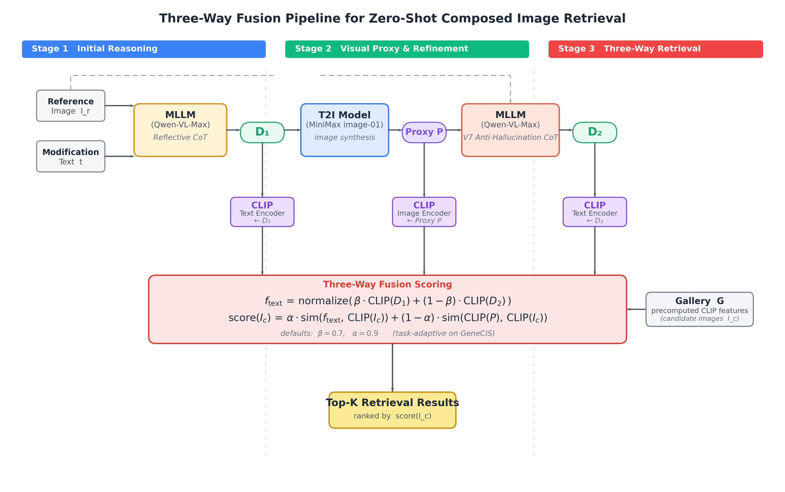
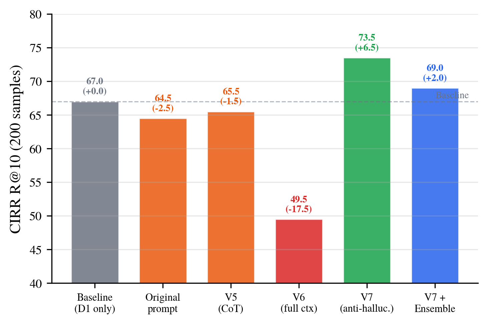
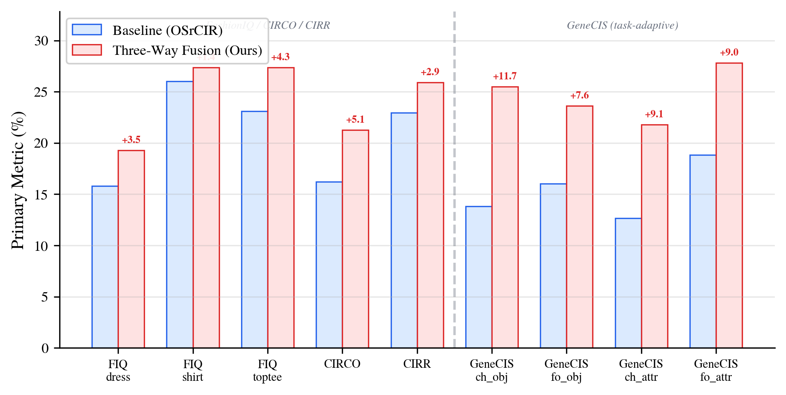
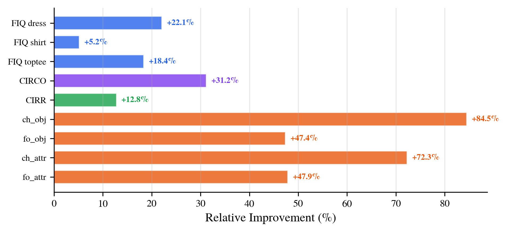
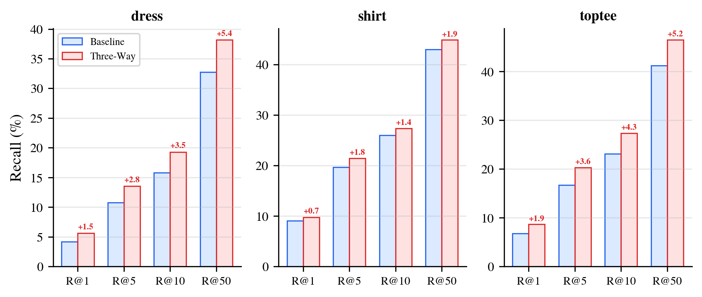
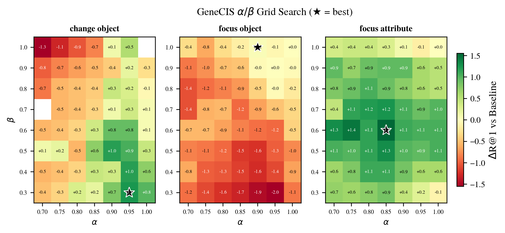

# 基于视觉代理与描述融合的零样本组合式图像检索改进

> **本文件说明**
> - 本文件为论文的 **Markdown 同步版**，内容与 `v5_同济格式_最终LaTeX.tex` 和 `v5_同济格式_最终.pdf` 严格一致；
> - 所有章节结构、公式、表格、图示和参考文献编号均与 LaTeX 版对应；
> - 图片引用使用相对路径 `../图表及代码/`，可直接在 GitHub / Typora / VSCode Markdown 预览中显示；
> - 若需正式投稿或打印，请以 `v5_同济格式_最终.pdf` 为准。

---

**TONGJI UNIVERSITY**

**毕业设计（论文）**

 

| 项目 | 内容 |
|:---:|:---|
| **课题名称** | 基于视觉代理与描述融合的零样本组合式图像检索改进 |
| **学院** | 电子与信息工程学院 |
| **专业** | 计算机科学与技术 |
| **学生姓名** | 杨昊明 |
| **学号** | （填写学号） |
| **指导教师** | （填写指导教师） |
| **日期** | 2026 年 5 月 |

---

## 摘 要

组合式图像检索任务要求系统根据一张参考图像及一段修改文本，在候选图库中检索出符合修改意图的目标图像。零样本组合式图像检索进一步要求方法在不依赖特定数据集训练的条件下完成跨域检索。OSrCIR 作为该方向的代表性方法，利用多模态大语言模型将参考图像与修改文本直接推理为目标描述，再通过 CLIP 编码完成检索。该方法虽然避免了传统两阶段方法中的信息损失，但其检索流程基本停留在文本空间，缺乏对描述结果的视觉验证机制，一旦初始描述偏离真实修改意图，后续检索结果便难以纠正。

针对上述问题，本文提出一种面向零样本组合式图像检索的三路融合方法。该方法主要包含三个部分：第一，提出视觉代理机制，将第一轮生成的目标描述输入文生图模型，生成代理图像，在图像空间提供辅助检索信号；第二，设计反幻觉提示词策略，使代理图仅作为诊断工具参与第二轮描述精炼，避免多模态大语言模型从 AI 生成图像中引入无关细节；第三，在 CLIP 特征空间中对原始描述、精炼描述及代理图特征进行加权融合，以兼顾稳健性与提升幅度。对于 GeneCIS 这类短文本、小图库场景，本文进一步采用专用提示词与任务自适应参数，提升方法适配性。

在 FashionIQ、CIRCO、CIRR 和 GeneCIS 共 9 个标准基准上的全量实验结果表明，所提出的方法在 35 项评估指标上实现了 35 项提升。主指标方面，FashionIQ dress 的 R@10 从 15.80 提升至 19.29，CIRCO 的 mAP@10 从 16.21 提升至 21.26，CIRR 的 R@1 从 22.96 提升至 25.90。对于 GeneCIS，经过专用提示词和参数调整后，4 个子任务的主指标也全部获得显著提升。实验结果说明，引入视觉代理与描述融合能够有效弥补单一路径检索的不足，提高零样本组合式图像检索方法的稳定性与泛化性能。

**关键词：** 零样本组合式图像检索；视觉代理；反幻觉提示词；描述融合；多模态大语言模型

---

## Abstract

Composed Image Retrieval (CIR) aims to retrieve target images from a gallery using a reference image and a modification text. Zero-Shot CIR further requires the retrieval model to generalize without task-specific training. OSrCIR, a recent representative approach, employs a multimodal large language model (MLLM) to directly infer a target description from the reference image and modification text, and then performs retrieval with CLIP. Although this design reduces information loss compared to previous two-stage pipelines, it still operates mainly in the text space and lacks a visual verification mechanism.

This thesis proposes a Three-Way Fusion framework for zero-shot composed image retrieval. The framework consists of three key components: (1) a visual proxy mechanism that converts the initial target description into a proxy image via a text-to-image model, providing an auxiliary retrieval signal in the image space; (2) an anti-hallucination prompting strategy for the second-round refinement stage, restricting the proxy image to a diagnostic role; and (3) weighted fusion of the CLIP features of the original description, the refined description, and the proxy image. For GeneCIS-style tasks with short texts and small galleries, dedicated prompts and task-adaptive parameters are further adopted.

Full-scale experiments on 9 standard benchmarks show that the proposed method improves all 35 evaluation metrics. On major metrics, the R@10 of FashionIQ dress increases from 15.80 to 19.29, the mAP@10 of CIRCO rises from 16.21 to 21.26, and the R@1 of CIRR improves from 22.96 to 25.90. For GeneCIS, all four sub-tasks also achieve significant improvements after applying dedicated prompts and adaptive parameters. These results demonstrate that visual proxy signals and description fusion can effectively compensate for the weakness of single-path retrieval and improve the robustness and generalization ability of zero-shot composed image retrieval.

**Keywords:** Zero-Shot Composed Image Retrieval; Visual Proxy; Anti-Hallucination Prompting; Description Fusion; Multimodal Large Language Model

---

## 目录

- [摘 要](#摘-要)
- [Abstract](#abstract)
- [第 1 章 绪论](#第-1-章-绪论)
  - [1.1 研究背景与意义](#11-研究背景与意义)
  - [1.2 国内外研究现状](#12-国内外研究现状)
  - [1.3 现有方法存在的问题](#13-现有方法存在的问题)
  - [1.4 本文主要工作](#14-本文主要工作)
  - [1.5 论文结构安排](#15-论文结构安排)
- [第 2 章 相关工作与技术基础](#第-2-章-相关工作与技术基础)
  - [2.1 组合式图像检索任务定义](#21-组合式图像检索任务定义)
  - [2.2 基于映射的方法](#22-基于映射的方法)
  - [2.3 基于推理的方法](#23-基于推理的方法)
  - [2.4 技术基础](#24-技术基础)
  - [2.5 本章小结](#25-本章小结)
- [第 3 章 三路融合方法](#第-3-章-三路融合方法)
  - [3.1 方法总体框架](#31-方法总体框架)
  - [3.2 视觉代理机制](#32-视觉代理机制)
  - [3.3 反幻觉描述精炼](#33-反幻觉描述精炼)
  - [3.4 描述融合策略](#34-描述融合策略)
  - [3.5 三路融合检索公式](#35-三路融合检索公式)
  - [3.6 方法特点总结](#36-方法特点总结)
  - [3.7 本章小结](#37-本章小结)
- [第 4 章 实验与结果分析](#第-4-章-实验与结果分析)
  - [4.1 实验设置](#41-实验设置)
  - [4.2 全量实验结果](#42-全量实验结果)
  - [4.3 消融实验与分析](#43-消融实验与分析)
  - [4.4 方法优势与局限](#44-方法优势与局限)
  - [4.5 本章小结](#45-本章小结)
- [第 5 章 总结与展望](#第-5-章-总结与展望)
  - [5.1 工作总结](#51-工作总结)
  - [5.2 未来工作展望](#52-未来工作展望)
- [参考文献](#参考文献)
- [谢辞](#谢辞)

---

## 第 1 章 绪论

### 1.1 研究背景与意义

图像检索是计算机视觉领域的重要研究方向，其目标是根据给定查询从大规模图库中找到语义最相关的图像 [[1](#ref1)]。随着视觉内容的复杂化与检索需求的多样化，用户的检索意图已不再局限于"找与这张图相似的图"或"找符合这段文本的图"，而常常表现为"保持图像主体不变，同时修改其中某些属性或对象"。例如，在服饰检索场景中，用户可能希望找到"与参考图同款但颜色改为红色的连衣裙"；在开放域场景中，用户可能希望找到"保留原有场景结构，但将猫替换为狗"的图像。为了满足这类复合查询需求，组合式图像检索（Composed Image Retrieval, CIR）任务应运而生 [[2](#ref2), [3](#ref3)]。

组合式图像检索的输入通常包括一张参考图像和一段修改文本，系统需要在候选图库中检索出既保留参考图关键视觉内容、又满足文本修改要求的目标图像。与传统图像检索相比，该任务要求模型同时理解视觉内容和语言约束，并在两种模态之间建立准确的组合关系，因此具有更高的研究难度。进一步地，零样本组合式图像检索（Zero-Shot CIR, ZS-CIR）不依赖目标数据集上的监督训练，而是借助预训练视觉语言模型完成检索推理，这使其更适合真实场景中的跨数据集应用。

近年来，多模态大语言模型（Multimodal Large Language Model, MLLM）与 CLIP [[6](#ref6)] 等视觉语言预训练模型的快速发展，为零样本组合式图像检索提供了新的技术路径。OSrCIR [[11](#ref11)] 等方法通过直接推理目标描述，显著推动了该任务的发展。然而，现有方法通常过于依赖单次文本推理结果，缺乏对生成描述的视觉层面验证。若初始描述遗漏关键信息或误解文本修改意图，模型便可能沿着错误方向继续检索。因此，如何在不依赖额外训练的情况下为检索流程引入视觉校验与多信号融合机制，是一个具有理论意义和实际价值的问题。

本文围绕上述问题展开研究，尝试通过视觉代理与描述融合提升零样本组合式图像检索性能。相关研究不仅可为多模态检索任务提供新的推理框架，也对电商搜索、图像编辑检索、内容创作辅助等实际应用具有一定参考价值。

### 1.2 国内外研究现状

从现有文献来看，零样本组合式图像检索方法大体可以分为两类。

第一类是基于映射的方法。此类方法的基本思想是将参考图像映射到文本空间，再与修改文本组合形成查询表示。例如，Pic2Word [[5](#ref5)] 将图像表示转换为可被文本编码器处理的伪词向量，从而在 CLIP 文本空间中表达图像内容；SEARLE [[4](#ref4)] 和 iSEARLE [[8](#ref8)] 通过文本反转等技术进一步增强了这种映射方式；LinCIR [[9](#ref9)] 则尝试只利用文本数据训练轻量映射模块。该路线的优点是推理流程较简单、效率较高，但其局限在于图像被映射到文本空间时容易丢失细粒度视觉信息。

第二类是基于推理的方法。该类方法利用多模态大语言模型直接理解参考图像和修改文本，并生成目标图像描述。CIReVL [[10](#ref10)] 采用"先描述参考图，再根据修改文本推理目标图"的两阶段策略，而 OSrCIR [[11](#ref11)] 则进一步提出单阶段反思推理，使模型在一个统一流程中完成理解、分析和生成。OSrCIR 利用反思式思维链（Reflective Chain-of-Thought）组织推理步骤，在多个标准数据集上取得了优于已有无训练方法的表现，成为该方向的重要代表工作。

尽管如此，现有基于推理的方法仍存在明显不足。一方面，模型主要输出一条文本路径，后续检索几乎完全依赖这条路径是否准确；另一方面，模型生成描述之后缺少可回看的视觉中间结果，因此很难判断推理是否偏离目标。换言之，当前方法在"推理能力"方面已经较强，但在"验证能力"和"融合能力"方面仍有较大改进空间。

### 1.3 现有方法存在的问题

通过对基线方法复现和多轮实验分析，本文将现有方法的问题总结为以下三点：

1. **初始描述缺乏视觉验证**。基线方法通常只调用一次多模态大语言模型，直接生成目标描述。如果该描述对颜色、物体或局部属性的理解出现误差，后续 CLIP 检索便会受到持续影响。
2. **单一路径检索较为脆弱**。CLIP 对文本表达方式较为敏感，即使两个描述语义接近，在特征空间中的位置也可能不同。检索系统完全依赖一条文本描述时，整体性能受单点误差影响较大。
3. **AI 生成图像虽然有潜在价值，但容易引入幻觉**。若直接让模型根据代理图重新写描述，模型往往会把代理图中的背景、材质、环境等虚构信息带入最终检索描述，反而使检索偏离目标。

因此，本文的关键问题在于：如何将 AI 生成图像作为一种"可用但不可信"的辅助信号纳入检索流程，同时避免其成为新的误差来源。

### 1.4 本文主要工作

针对上述问题，本文围绕 OSrCIR 基线方法提出了三路融合改进框架。主要工作如下：

1. **提出视觉代理机制**。将第一轮生成的目标描述输入文生图模型，生成代理图像，为检索阶段提供图像空间的辅助信号。
2. **设计反幻觉精炼策略**。通过专门设计的提示词，要求模型将代理图仅作为诊断工具使用，只检查修改是否正确应用，而不能将代理图中的细节直接写入目标描述。
3. **提出描述融合与三路融合方案**。在 CLIP 特征空间中对原始描述、精炼描述及代理图特征进行加权融合，兼顾稳健性与检索精度。
4. **针对 GeneCIS 等小图库短文本任务**，进一步探索专用提示词与任务自适应参数设置，验证方法在不同任务类型上的可扩展性。

### 1.5 论文结构安排

全文共分为五章。第一章介绍研究背景、相关现状及本文的研究问题。第二章回顾组合式图像检索相关工作及本文依赖的技术基础。第三章详细介绍三路融合方法的设计思路和实现方式。第四章给出实验设置、全量实验结果及消融分析。第五章总结全文并对后续工作进行展望。

---

## 第 2 章 相关工作与技术基础

### 2.1 组合式图像检索任务定义

组合式图像检索任务以参考图像和修改文本为查询，要求从图库中检索出最符合修改意图的目标图像。形式化地，设参考图像为 $I_r$，修改文本为 $t$，候选图库为 $\mathcal{G}=\{I_1,I_2,\ldots,I_N\}$，模型需要找到满足"保持参考图关键内容并应用文本修改"的目标图像 $I_t$。与单模态检索不同，该任务同时涉及视觉保留与语义变换两类需求，因此具有更高的组合推理难度。

在零样本设定中，模型不能在目标数据集上进行监督训练，而必须依赖预训练模型完成推理与匹配。这一设定能够更好地反映真实环境中的通用检索需求，但也提高了对模型泛化能力的要求。

### 2.2 基于映射的方法

基于映射的方法尝试把参考图像转换成可与修改文本结合的文本空间表示。Pic2Word [[5](#ref5)] 通过训练映射模块，将图像特征映射为伪词表示后与文本联合编码。SEARLE [[4](#ref4)]、iSEARLE [[8](#ref8)] 等方法围绕文本反转和特征对齐进行了改进。LinCIR [[9](#ref9)] 则以更轻量的方式在文本空间中完成变换建模。

这类方法的优势在于结构简单、推理速度较快，而且不必额外依赖大规模推理模型。然而，映射过程不可避免地会压缩视觉信息，尤其在细粒度属性或局部物体变化场景中，图像内容被"翻译"为文本空间表示后可能丢失关键细节。

### 2.3 基于推理的方法

基于推理的方法更强调多模态理解能力。CIReVL [[10](#ref10)] 先生成参考图像标题，再根据修改文本推理目标描述；OSrCIR [[11](#ref11)] 则将参考图像和修改文本同时输入多模态大语言模型，并通过反思式思维链组织推理流程，减少了两阶段方法中的信息损失问题。

OSrCIR 的重要意义在于，它证明了不经过专门训练也可以利用强大的多模态推理能力完成组合式检索。但与此同时，OSrCIR 也暴露出一个新的问题：当模型生成的目标描述出现偏差时，系统缺乏视觉反馈机制进行纠正。

### 2.4 技术基础

#### 2.4.1 CLIP

CLIP [[6](#ref6)] 是当前跨模态检索中最常用的基础模型之一。它通过大规模图文对比学习，将图像和文本编码到统一特征空间中。本文采用与基线方法一致的 CLIP ViT-L/14 作为特征编码器，分别编码文本描述、代理图像和候选图库图像，并通过余弦相似度计算检索得分。

#### 2.4.2 多模态大语言模型

多模态大语言模型能够同时处理图像与文本输入，并输出具备较强推理能力的自然语言结果。本文复现基线时，由于接口可用性原因，使用 Qwen-VL-Max [[14](#ref14)] 替代原论文中的 GPT-4o [[13](#ref13)]。尽管模型能力存在差异，但所有改进实验均基于同一模型展开，保证了对比公平性。

#### 2.4.3 文生图模型

文生图模型可以根据文本描述生成图像 [[16](#ref16), [17](#ref17)]。本文并不将代理图作为最终输出，而是将其视为中间推理产物，用于补充图像空间信号并辅助第二轮精炼。本文实验中使用 MiniMax image-01 生成代理图。

### 2.5 本章小结

本章回顾了组合式图像检索任务的发展脉络，梳理了基于映射与基于推理两类零样本方法的代表工作，并介绍了本文使用的 CLIP、多模态大语言模型及文生图模型等技术基础。

---

## 第 3 章 三路融合方法

### 3.1 方法总体框架

本文提出的三路融合方法在 OSrCIR 基线流程上增加了视觉代理和描述精炼两个环节，并在检索阶段统一融合三类信号。整体流程如图 [3-1](#fig-pipeline) 所示：

1. 输入参考图像与修改文本，由多模态大语言模型生成第一轮目标描述 $D_1$。
2. 将 $D_1$ 输入文生图模型，生成代理图像 $P$。
3. 将参考图像、代理图像和修改文本再次输入多模态大语言模型，通过反幻觉提示词生成第二轮精炼描述 $D_2$。
4. 通过 CLIP 对 $D_1$、$D_2$ 和 $P$ 分别编码，在特征空间中完成描述融合和三路检索得分融合。

**图 3-1** 三路融合方法总体流程。第一阶段生成初始描述 $D_1$ 并通过文生图模型生成代理图像；第二阶段利用反幻觉提示词精炼描述；检索阶段融合三路 CLIP 特征计算最终得分。

该框架的核心思想是：让文本推理、视觉代理和精炼描述相互补充，而不是依赖单一路径完成检索。

### 3.2 视觉代理机制

#### 3.2.1 设计动机

在基线方法中，第一轮目标描述 $D_1$ 既承担理解修改意图的任务，也直接决定最终检索方向。若 $D_1$ 存在偏差，系统没有任何视觉信号帮助判断其是否正确。为了解决这一问题，本文提出将 $D_1$ 进一步转化为代理图像。尽管代理图不是目标图像本身，但它能够把文本推理结果投射到图像空间中，为后续判断提供更直观的中间参考。

#### 3.2.2 作用分析

视觉代理有两类作用。第一，它在检索阶段提供图像特征信号，可以与文本特征形成互补。第二，它为第二轮精炼提供对照依据，使模型能够检查第一轮描述是否正确表达了修改意图，例如颜色是否改变、被替换的对象是否合理、应保留的主体是否仍然存在等。

在 FashionIQ dress 的小规模试验中，仅使用代理图后融合便带来了明显提升，这说明代理图虽然包含噪声，但确实具有检索价值。

### 3.3 反幻觉描述精炼

#### 3.3.1 问题来源

直接把代理图输入模型进行第二轮描述精炼并不总是有效。实验发现，若没有明确限制，模型会倾向于把代理图中的虚构背景、材质和环境细节写进新的目标描述，导致描述冗长且偏离真实目标。这种现象本质上是由 AI 生成图像的幻觉问题引起的。

#### 3.3.2 V7 反幻觉策略

为此，本文设计了 V7 反幻觉提示词，其核心原则是"代理图只做诊断，不做描述来源"。具体而言：

1. 明确告诉模型代理图是 AI 生成结果，可能含有错误与幻觉。
2. 要求模型仅利用代理图检查修改是否被正确应用，而不能直接复制其视觉细节。
3. 要求输出目标描述尽量简短，只保留与检索最相关的核心属性。

这一定义使第二轮精炼的任务从"重新描写目标图像"转变为"在已有描述基础上做最小必要修正"，从而有效降低了幻觉引入风险。

#### 3.3.3 Prompt 演进过程

在正式确定 V7 之前，项目经历了多个版本的 prompt 迭代，如图 [3-2](#fig-prompt) 所示。早期版本直接比较原图与代理图，结果在 CIRR 上出现了性能下降；加入思维链后虽然略有改善，但未根本解决幻觉问题；把第一轮上下文全部交给模型后甚至导致严重退化（R@10 从 67.0 跌至 49.5）。V7 的突破在于明确切断"从代理图复制细节"的路径，使代理图成为诊断工具而非描述来源。

**图 3-2** 不同版本 prompt 在 CIRR 数据集上的 R@10 表现（200 样本）。V6 因信息过载导致灾难性退化，V7 通过反幻觉策略实现突破。

### 3.4 描述融合策略

#### 3.4.1 设计动机

尽管第二轮精炼在不少样本上是有帮助的，但它在某些样本上仍可能造成信息压缩或局部退化。如果直接用 $D_2$ 替换 $D_1$，系统性能可能因为少量异常样本而下降。因此，本文不采用"替换"而采用"融合"思路。

#### 3.4.2 融合公式

设第一轮描述特征为 $\mathrm{CLIP}(D_1)$，第二轮精炼描述特征为 $\mathrm{CLIP}(D_2)$，则文本融合特征定义为：

$$
\mathbf{f}_{\text{text}} = \mathrm{normalize}\!\left(\beta \cdot \mathrm{CLIP}(D_1) + (1-\beta) \cdot \mathrm{CLIP}(D_2)\right)
\tag{3-1}
$$

其中，$\beta$ 用于控制对原始描述与精炼描述的信任程度。本文在默认设置下取 $\beta=0.7$，即以原始描述为主、精炼描述为辅。这种设置既能利用精炼的增益，也能避免因精炼失误而整体退化。

### 3.5 三路融合检索公式

在完成文本特征融合后，本文进一步将代理图像特征纳入最终得分计算。设候选图库图像为 $I_c$，代理图像特征为 $\mathrm{CLIP}(P)$，则最终得分定义为：

$$
\mathrm{score}(I_c) = \alpha \cdot \mathrm{sim}\!\left(\mathbf{f}_{\text{text}}, \mathrm{CLIP}(I_c)\right) + (1-\alpha) \cdot \mathrm{sim}\!\left(\mathrm{CLIP}(P), \mathrm{CLIP}(I_c)\right)
\tag{3-2}
$$

其中 $\alpha$ 控制文本信号与代理图信号的权重。默认设置为 $\alpha=0.9$，即文本为主、图像为辅。这样设计的原因在于：代理图虽然提供额外视觉线索，但其本身可能含有生成噪声，因此更适合作为辅助信号而非主导信号。

### 3.6 方法特点总结

与基线方法相比，三路融合方法具备以下特点：

1. 保留了基线方法无训练推理的优点，不需要对目标数据集额外训练。
2. 通过代理图引入了图像空间信号，补足了纯文本流程的短板。
3. 通过描述融合增强了系统稳健性，降低了第二轮精炼失误带来的风险。
4. 通过可调节的 $\alpha$ 和 $\beta$ 将不同模块统一在一个框架下，便于消融分析和后续扩展。

### 3.7 本章小结

本章围绕三路融合方法的设计思想与实现流程展开介绍，分别说明了视觉代理、反幻觉精炼和描述融合的动机、机制及统一公式。该方法为后续实验验证奠定了基础。

---

## 第 4 章 实验与结果分析

### 4.1 实验设置

#### 4.1.1 数据集

本文在 4 个标准基准数据集上的 9 个子任务上进行评估：

- **FashionIQ** [[18](#ref18)]：包含 dress、shirt、toptee 三个服饰子集。
- **CIRCO** [[7](#ref7)]：开放域组合检索数据集，gallery 规模约 123K。
- **CIRR** [[19](#ref19)]：自然场景组合检索数据集，gallery 规模约 2297。
- **GeneCIS** [[20](#ref20)]：包含 change_object、focus_object、change_attribute、focus_attribute 四个子任务，每个查询对应仅约 14 张候选图。

#### 4.1.2 实现细节

- 多模态模型：Qwen-VL-Max。
- 文生图模型：MiniMax image-01。
- 视觉语言编码器：CLIP ViT-L/14。
- 默认融合参数：$\beta=0.7$，$\alpha=0.9$。
- 运行环境：描述生成与代理图生成在 Linux 服务器完成，CLIP 编码和大规模检索在 Windows RTX 4060 环境下完成。

#### 4.1.3 关于基线复现的说明

原论文 OSrCIR 使用 GPT-4o，而本文出于接口可用性原因使用 Qwen-VL-Max 进行复现。因此，本工作的 Baseline 在部分数据集上的绝对数值低于原论文结果。但由于本文所有改进均建立在同一 Baseline 之上，因此不同方案之间的比较仍然是公平的。基线复现与原论文的对比见表 [4-1](#tab-baseline)。

**表 4-1** 基线复现与原论文对比

| 数据集 | 主指标 | 原论文 (GPT-4o) | 本文 Baseline (Qwen-VL) | 差距 |
|:---|:---|---:|---:|---:|
| FIQ dress  | R@10   | 29.70 | 15.80 | −13.90 |
| FIQ shirt  | R@10   | 33.17 | 26.00 | −7.17 |
| FIQ toptee | R@10   | 36.92 | 23.09 | −13.83 |
| CIRR       | R@1    | 29.45 | 22.96 | — |
| CIRCO      | mAP@10 | 25.33 | 16.21 | — |

### 4.2 全量实验结果

#### 4.2.1 总体结果

在 9 个数据集上的全量实验结果如图 [4-1](#fig-main) 所示，主指标汇总见表 [4-2](#tab-main)。全部 35 项评估指标均获得提升，无持平、无退化。

**图 4-1** 9 个数据集主指标对比。蓝色为 Baseline，红色为三路融合方法，数字标注为绝对提升值。

**表 4-2** 全量实验主指标汇总（9 个数据集）

| 数据集 | 主指标 | Baseline | 三路融合 | 绝对提升 | 相对提升 |
|:---|:---|---:|---:|---:|---:|
| FIQ dress        | R@10   | 15.80 | **19.29** | +3.49  | +22.1% |
| FIQ shirt        | R@10   | 26.00 | **27.35** | +1.35  | +5.2%  |
| FIQ toptee       | R@10   | 23.09 | **27.35** | +4.26  | +18.4% |
| CIRCO            | mAP@10 | 16.21 | **21.26** | +5.05  | +31.2% |
| CIRR             | R@1    | 22.96 | **25.90** | +2.94  | +12.8% |
| GeneCIS ch_obj   | R@1    | 13.83 | **25.51** | +11.68 | +84.5% |
| GeneCIS fo_obj   | R@1    | 16.02 | **23.62** | +7.60  | +47.4% |
| GeneCIS ch_attr  | R@1    | 12.65 | **21.79** | +9.14  | +72.3% |
| GeneCIS fo_attr  | R@1    | 18.82 | **27.83** | +9.01  | +47.9% |

各数据集的相对提升幅度如图 [4-2](#fig-relative) 所示。GeneCIS 的提升最为显著（+47% ~ +85%），FashionIQ 和 CIRCO 也达到了 +5% ~ +31% 的相对提升。

**图 4-2** 各数据集主指标的相对提升百分比。

#### 4.2.2 FashionIQ

FashionIQ 三个子集的详细实验结果如图 [4-3](#fig-fiq) 和表 [4-3](#tab-fiq) 所示。三个子集 12 项指标全部正向提升，说明在服饰检索场景中，代理图与描述融合能够较好捕获颜色、纹理和款式等变化信息。

**图 4-3** FashionIQ 三个子集的详细指标对比。

**表 4-3** FashionIQ 全量实验结果

| 子集 | 指标 | Baseline | Ensemble | 三路融合 | 提升 |
|:---|:---|---:|---:|---:|---:|
| **dress** | R@1  | 4.17  | 5.01  | **5.63**  | +1.46 |
|           | R@5  | 10.79 | 13.03 | **13.56** | +2.76 |
|           | R@10 | 15.80 | 18.30 | **19.29** | +3.49 |
|           | R@50 | 32.74 | 36.81 | **38.16** | +5.42 |
| **shirt** | R@1  | 9.07  | 10.02 | **9.77**  | +0.70 |
|           | R@5  | 19.64 | 21.69 | **21.44** | +1.80 |
|           | R@10 | 26.00 | 27.35 | **27.35** | +1.35 |
|           | R@50 | 42.94 | 45.09 | **44.84** | +1.90 |
| **toptee**| R@1  | 6.81  | 8.11  | **8.68**  | +1.87 |
|           | R@5  | 16.69 | 19.81 | **20.28** | +3.59 |
|           | R@10 | 23.09 | 26.57 | **27.35** | +4.26 |
|           | R@50 | 41.19 | 46.18 | **46.44** | +5.25 |

#### 4.2.3 CIRCO

CIRCO 的结果提升最为显著，如表 [4-4](#tab-circo) 所示。mAP@10 从 16.21 提升到 21.26，相对提升达到 31.2%。这说明在开放域场景下，视觉代理对于复杂语义修改具有较高价值。

**表 4-4** CIRCO 全量实验结果

| 指标 | Baseline | Ensemble | 三路融合 | 提升 |
|:---|---:|---:|---:|---:|
| mAP@5  | 15.72 | 18.06 | **20.36** | +4.64 |
| mAP@10 | 16.21 | 18.69 | **21.26** | +5.05 |
| mAP@25 | 18.25 | 20.55 | **23.16** | +4.91 |
| mAP@50 | 19.04 | 21.48 | **24.06** | +5.02 |

#### 4.2.4 CIRR

CIRR 的 7 项指标全部提升，如表 [4-5](#tab-cirr) 所示。其中 R@1 从 22.96 提升到 25.90。CIRR 数据包含多样的自然场景修改，实验结果表明本文方法在更复杂的通用场景检索中同样具有稳定增益。

**表 4-5** CIRR 全量实验结果

| 指标 | Baseline | Ensemble | 三路融合 | 提升 |
|:---|---:|---:|---:|---:|
| R@1      | 22.96 | 25.28 | **25.90** | +2.94 |
| R@5      | 53.03 | 56.02 | **56.28** | +3.25 |
| R@10     | 65.85 | 68.76 | **68.72** | +2.87 |
| R@50     | 86.96 | 89.33 | **89.50** | +2.54 |
| R_sub@1  | 46.26 | 48.51 | **48.89** | +2.63 |
| R_sub@2  | 67.95 | 69.94 | **70.06** | +2.10 |
| R_sub@3  | 80.96 | 82.56 | **82.40** | +1.44 |

#### 4.2.5 GeneCIS

GeneCIS 的任务形式与前述数据集不同，其修改文本通常很短（1–2 个词），且每个查询仅对应一个局部小图库（约 14 张）。在这种设定下，统一默认参数并非最优。本文为该数据集设计了专用 prompt，并对 $\alpha$ 和 $\beta$ 进行任务自适应调整。最终结果如表 [4-6](#tab-genecis) 所示，4 个子任务的 R@1 全部大幅提升。

**表 4-6** GeneCIS 全量实验结果（专用 prompt + 任务自适应参数）

| 子集 | 样本数 | 指标 | Baseline | 三路融合 | 提升 |
|:---|---:|:---:|---:|---:|---:|
| change_object    | 1960 | R@1 | 13.83 | **25.51** | +11.68 |
| focus_object     | 1960 | R@1 | 16.02 | **23.62** | +7.60  |
| change_attribute | 2110 | R@1 | 12.65 | **21.79** | +9.14  |
| focus_attribute  | 1998 | R@1 | 18.82 | **27.83** | +9.01  |

### 4.3 消融实验与分析

#### 4.3.1 Prompt 版本对比

项目中先后测试了多版精炼 prompt，在 CIRR 200 样本上的结果对比如图 [3-2](#fig-prompt) 所示。早期版本容易将代理图中的幻觉细节写入描述，导致性能下降；V7 是第一个在保证整体稳定性的同时显著提升 CIRR 的版本。虽然 V7 在个别子集上仍有退化风险，但结合描述融合后，这一问题得到了明显缓解。

#### 4.3.2 α / β 参数分析

在 GeneCIS 上的网格搜索结果如图 [4-4](#fig-heatmap) 所示。不同子任务对参数的偏好存在显著差异。例如，focus_object 最优时几乎完全不使用精炼描述（$\beta=1.0$），而 change_object 更依赖第二轮描述（$\beta=0.3$）。该结果说明，任务自适应参数配置对短文本、小图库、细粒度检索任务尤其重要。

**图 4-4** GeneCIS 三个子集的 $\alpha$ / $\beta$ 网格搜索热力图。颜色表示相对 Baseline 的 R@1 变化量，★ 标记最优参数组合。

表 [4-7](#tab-grid) 汇总了各子集的最优参数及其提升效果。

**表 4-7** GeneCIS 各子集最优 $\alpha$ / $\beta$ 参数

| 子集 | 默认参数 ΔR@1 | 最优 β | 最优 α | 最优 ΔR@1 |
|:---|---:|---:|---:|---:|
| change_object    | +0.10 | 0.30 | 0.95 | +1.02 |
| focus_object     | −0.87 | 1.00 | 0.90 | +0.05 |
| change_attribute | +0.28 | 0.80 | 0.80 | +1.33 |
| focus_attribute  | +1.05 | 0.60 | 0.85 | +1.55 |

#### 4.3.3 各模块作用分析

从方法结构上看，视觉代理、反幻觉精炼和描述融合分别解决了不同问题。视觉代理负责补充图像空间信号，反幻觉精炼负责提升第二轮描述质量，描述融合负责提供稳健性。表 [4-8](#tab-ablation) 给出了方法迭代过程中各方案的演进逻辑。

**表 4-8** 方法迭代过程各阶段的作用与局限

| 阶段 | 方案 | 解决的问题 | 遗留问题 |
|:---:|:---|:---|:---|
| 1 | Visual Proxy | $D_1$ 缺乏视觉验证 | 代理图含 AI 幻觉 |
| 2 | 直接精炼 | 尝试利用代理图修正 $D_1$ | 幻觉反而加剧退化 |
| 3 | V7 反幻觉 prompt | 切断幻觉引入路径 | 个别子集退化 |
| 4 | Description Ensemble | 融合 $D_1$/$D_2$ 防止退化 | 提升幅度受保守融合约束 |
| 5 | 三路融合 | 统一框架，三信号互补 | GeneCIS 有优化空间 |
| 6 | 专用 prompt | task-adaptive 优化 | 4/4 子集全部正向 |

### 4.4 方法优势与局限

本文方法的优势主要体现在：（1）不依赖目标数据集训练，保持了零样本方法的通用性；（2）通过视觉代理引入了额外的图像空间信号；（3）通过描述融合降低了单次推理失误带来的不稳定性；（4）通过 prompt 和参数适配，具备向不同任务类型扩展的潜力。

同时，该方法也存在一定局限：（1）相比基线需要额外一次文生图调用和一次精炼推理，推理成本更高；（2）参数对任务类型较敏感，统一默认参数并非所有场景下都最优；（3）方法整体效果仍受多模态大语言模型本身能力影响。

### 4.5 本章小结

本章介绍了实验设置，并从整体结果、消融实验和方法讨论三个层面分析了三路融合方法的表现。实验结果表明，所提出方法能够在多个标准数据集上获得稳定提升，验证了其有效性和通用性。

---

## 第 5 章 总结与展望

### 5.1 工作总结

本文围绕零样本组合式图像检索中"缺乏视觉验证、依赖单一路径文本检索"的问题，提出了三路融合方法，并完成了基线复现、方法设计、Prompt 迭代与全量实验验证。主要结论概括为以下几点：

1. 在纯文本推理流程中引入视觉代理能够有效补充图像空间信号，提高组合式检索性能。
2. 代理图虽然有价值，但必须通过明确的反幻觉策略加以约束，否则容易引入新的误差。
3. 通过在 CLIP 特征空间中融合原始描述与精炼描述，可以在提升性能的同时保持系统稳健性。
4. 对于短文本、小图库和细粒度任务，专用 prompt 与任务自适应参数具有重要作用。

综合来看，本文提出的方法在 9 个标准任务上取得了统一正向结果，证明了视觉代理与描述融合在零样本组合式图像检索中的有效性。

### 5.2 未来工作展望

未来可以从以下几个方向继续完善本研究：

1. 研究查询自适应参数预测机制，减少人工调参需求。
2. 尝试使用更强的多模态模型，以提升第一轮描述质量和整体上限。
3. 探索多代理图或代理图质量优化策略，提高图像空间辅助信号的可靠性。
4. 将该框架拓展到有监督组合式图像检索任务，验证其在更广泛检索场景中的适用性。

---

## 参考文献

[1] Datta R, Joshi D, Li J, et al. Image retrieval: Ideas, influences, and trends of the new age[J]. ACM Computing Surveys, 2008, 40(2): 1–60.

[2] Vo N, Jiang L, Sun C, et al. Composing text and image for image retrieval — an empirical odyssey[C]//Proceedings of the IEEE/CVF Conference on Computer Vision and Pattern Recognition, 2019: 6439–6448.

[3] Song X, Lin H, Wen H, et al. A comprehensive survey on composed image retrieval[J]. ACM Transactions on Information Systems, 2025, 43(3): 1–40.

[4] Baldrati A, Agnolucci L, Bertini M, et al. Zero-shot composed image retrieval with textual inversion[C]//Proceedings of the IEEE/CVF International Conference on Computer Vision, 2023: 15338–15347.

[5] Saito K, Sohn K, Zhang X, et al. Pic2Word: Mapping pictures to words for zero-shot composed image retrieval[C]//Proceedings of the IEEE/CVF Conference on Computer Vision and Pattern Recognition, 2023: 19305–19314.

[6] Radford A, Kim J W, Hallacy C, et al. Learning transferable visual models from natural language supervision[C]//Proceedings of the 38th International Conference on Machine Learning, 2021: 8748–8763.

[7] Baldrati A, Agnolucci L, Bertini M, et al. Conditioned and composed image retrieval combining and partially fine-tuning CLIP-based features[C]//Proceedings of the IEEE/CVF Conference on Computer Vision and Pattern Recognition Workshops, 2022: 4959–4968.

[8] Baldrati A, Agnolucci L, Bertini M, et al. iSEARLE: Improving textual inversion for zero-shot composed image retrieval[J]. IEEE Transactions on Pattern Analysis and Machine Intelligence, 2025.

[9] Gu G, Chun S, Kim W, et al. LinCIR: Language-only training of zero-shot composed image retrieval[C]//Proceedings of the IEEE/CVF Conference on Computer Vision and Pattern Recognition, 2024.

[10] Karthik S, Roth K, Mancini M, et al. Vision-by-language for training-free compositional image retrieval[C]//Proceedings of the International Conference on Learning Representations, 2024.

[11] Tang Y, Zhang J, Qin X, et al. Reason-before-Retrieve: One-stage reflective chain-of-thoughts for training-free zero-shot composed image retrieval[C]//Proceedings of the IEEE/CVF Conference on Computer Vision and Pattern Recognition, 2025: 14400–14410.

[12] Delmas G, Rezende R S, Csurka G, et al. ARTEMIS: Attention-based retrieval with text-explicit matching and implicit similarity[C]//Proceedings of the International Conference on Learning Representations, 2022.

[13] OpenAI. GPT-4o system card[R]. 2024.

[14] Bai J, Bai S, Yang S, et al. Qwen-VL: A versatile vision-language model for understanding, localization, text reading, and beyond[J]. arXiv preprint arXiv:2308.12966, 2023.

[15] Liu H, Li C, Wu Q, et al. Visual instruction tuning[C]//Advances in Neural Information Processing Systems, 2023.

[16] Ramesh A, Dhariwal P, Nichol A, et al. Hierarchical text-conditional image generation with CLIP latents[J]. arXiv preprint arXiv:2204.06125, 2022.

[17] Rombach R, Blattmann A, Lorenz D, et al. High-resolution image synthesis with latent diffusion models[C]//Proceedings of the IEEE/CVF Conference on Computer Vision and Pattern Recognition, 2022: 10684–10695.

[18] Wu H, Gao Y, Guo X, et al. Fashion IQ: A new dataset towards retrieving images by relative natural language feedback[C]//Proceedings of the IEEE/CVF Conference on Computer Vision and Pattern Recognition, 2021: 11307–11317.

[19] Liu Z, Rodriguez-Opazo C, Teney D, et al. Image retrieval on real-life images with pre-trained vision-and-language models[C]//Proceedings of the IEEE/CVF International Conference on Computer Vision, 2021: 2125–2134.

[20] Vaze S, Rocco I, Rupprecht C, et al. GeneCIS: A benchmark for general conditional image similarity[C]//Proceedings of the IEEE/CVF Conference on Computer Vision and Pattern Recognition, 2023: 6862–6872.

---

## 谢辞

感谢指导教师在课题研究和论文撰写过程中给予的指导与帮助。感谢相关开源工作与数据集作者提供研究基础。感谢项目实验过程中所使用的 API 服务与计算环境支持，使本文实验得以顺利完成。

---

*文档版本：v5 同济格式最终版 Markdown 同步版*
*作者：杨昊明* · *日期：2026 年 5 月* · *同济大学本科毕业设计（论文）*
